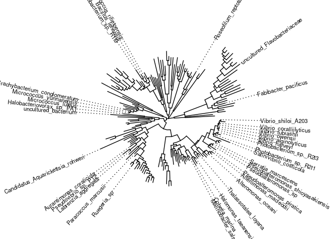
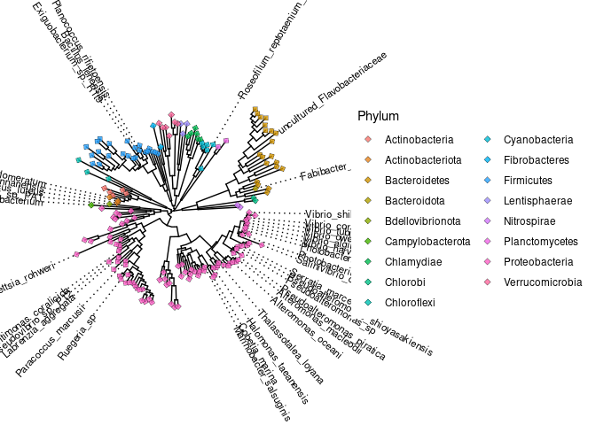
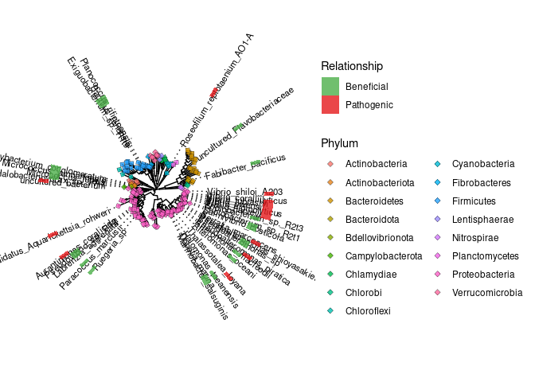

Coral Microbiome
================
Ahmed Moustafa
11 July, 2022

``` r
library(tidyverse)
library(ggtree)
library(ggstar)
library(ggtreeExtra)
library(phytools)
library(ggnewscale)
```

``` r
taxa = read_tsv("data/taxa.tsv", col_types = 'ccf')
head(taxa)
```

    ## # A tibble: 6 × 3
    ##   label                                                             name  phylum
    ##   <chr>                                                             <chr> <fct> 
    ## 1 Archaea__Euryarchaeota__Methanomicrobia__Methanocellales__Methan… Meth… Eurya…
    ## 2 Archaea__Euryarchaeota__Methanomicrobia__Methanomicrobiales__Met… Meth… Eurya…
    ## 3 Archaea__Euryarchaeota__Methanomicrobia__Methanosarcinales__Meth… Meth… Eurya…
    ## 4 Bacteria__Actinobacteria__Actinobacteria__Actinomycetales__Actin… Acti… Actin…
    ## 5 Bacteria__Actinobacteria__Actinobacteria__Micrococcales__Microba… Micr… Actin…
    ## 6 Bacteria__Actinobacteria__Actinobacteria__Micrococcales__Microco… Yani… Actin…

``` r
relationships = read_tsv("data/relationships.tsv")
```

    ## Rows: 50 Columns: 2
    ## ── Column specification ────────────────────────────────────────────────────────────────────────────────────────────────────────────────────────────────────────────────────────────────────────────────────
    ## Delimiter: "\t"
    ## chr (2): label, type
    ## 
    ## ℹ Use `spec()` to retrieve the full column specification for this data.
    ## ℹ Specify the column types or set `show_col_types = FALSE` to quiet this message.

``` r
head(relationships)
```

    ## # A tibble: 6 × 2
    ##   label                                                                    type 
    ##   <chr>                                                                    <chr>
    ## 1 Bacteria__Actinobacteriota__Actinobacteria__Micrococcales__Dermabactera… Bene…
    ## 2 Bacteria__Actinobacteriota__Actinobacteria__Micrococcales__Micrococcace… Bene…
    ## 3 Bacteria__Actinobacteriota__Actinobacteria__Micrococcales__Micrococcace… Bene…
    ## 4 Bacteria__Bacteroidetes__Flavobacteriia__Flavobacteriales__Flavobacteri… Bene…
    ## 5 Bacteria__Bacteroidota__Bacteroidia__Cytophagales__Cyclobacteriaceae__F… Bene…
    ## 6 Bacteria__Bdellovibrionota__Bdellovibrionia__Bacteriovoracales__Bacteri… Bene…

``` r
tree = read.tree("/home/ahmed/projects/coral-microbiome/tree/coral-microbiome.tre")
tree
```

    ## 
    ## Phylogenetic tree with 178 tips and 176 internal nodes.
    ## 
    ## Tip labels:
    ##   Bacteria__Nitrospirae__Nitrospira__Nitrospirales__Nitrospiraceae__Leptospirillum__Leptospirillum_ferrooxidans--X86776.1.1484, Bacteria__Nitrospirae__Nitrospira__Nitrospirales__Nitrospiraceae__Thermodesulfovibrio__Thermodesulfovibrio_yellowstonii--AB231858.1.1461, Bacteria__Chlorobi__Chlorobia__Chlorobiales__Chlorobiaceae__Prosthecochloris__Prosthecochloris_aestuarii_DSM_271--CP001108.147535.149029, Bacteria__Chlorobi__Chlorobia__Chlorobiales__Chlorobiaceae__Chlorobium__Chlorobium_limicola_DSM_245--CP001097.112995.114488, Bacteria__Bacteroidota__Bacteroidia__Cytophagales__Cyclobacteriaceae__Fabibacter__Fabibacter_pacificus--KC005305.1.1442, Bacteria__Bacteroidetes__Cytophagia__Cytophagales__Flammeovirgaceae__Reichenbachiella__Bacteroidetes_bacterium_O_014--DQ812543.1.1464, ...
    ## Node labels:
    ##   , 0.845, 0.994, 0.907, 1.000, 1.000, ...
    ## 
    ## Unrooted; includes branch lengths.

``` r
p1 = ggtree(tree, layout = "circular", open.angle = 10) +
  geom_tiplab(aes(subset = label %in% relationships$label,
                  label = gsub(".*__", "", gsub("--.*", "", label))),
              align = TRUE,
              size = 3)

p1
```

<!-- -->

``` r
p2 = p1 + 
      geom_fruit(
          data = taxa,
          geom = geom_star,
          mapping = aes(y=label, fill = phylum),
          position = "identity",
          starshape = 28,
          starstroke = 0.2,
          alpha = 0.8,
          size = 2) +
  labs (fill = "Phylum") + 
  guides(fill=guide_legend(ncol = 2))

p2
```

<!-- -->

``` r
p3 = p2 +
  new_scale_fill() +
  
  geom_fruit(
    data = relationships,
    geom = geom_tile,
    mapping = aes(y = label, x = type, fill = type),
    alpha = 0.8,
    offset = 0.5) +
   
  scale_fill_manual(
          name = "Relationship",
          values=c("#4daf4a", "#e41a1c"))

p3
```

<!-- -->

``` r
ggsave("figures/coral_microbiome.pdf", width = 15, height = 15)
```

``` r
sessionInfo()
```

    ## R version 4.2.1 (2022-06-23)
    ## Platform: x86_64-pc-linux-gnu (64-bit)
    ## Running under: Ubuntu 20.04.4 LTS
    ## 
    ## Matrix products: default
    ## BLAS:   /usr/lib/x86_64-linux-gnu/blas/libblas.so.3.9.0
    ## LAPACK: /usr/lib/x86_64-linux-gnu/lapack/liblapack.so.3.9.0
    ## 
    ## locale:
    ##  [1] LC_CTYPE=en_US.UTF-8       LC_NUMERIC=C              
    ##  [3] LC_TIME=en_US.UTF-8        LC_COLLATE=en_US.UTF-8    
    ##  [5] LC_MONETARY=en_US.UTF-8    LC_MESSAGES=en_US.UTF-8   
    ##  [7] LC_PAPER=en_US.UTF-8       LC_NAME=C                 
    ##  [9] LC_ADDRESS=C               LC_TELEPHONE=C            
    ## [11] LC_MEASUREMENT=en_US.UTF-8 LC_IDENTIFICATION=C       
    ## 
    ## attached base packages:
    ## [1] stats     graphics  grDevices utils     datasets  methods   base     
    ## 
    ## other attached packages:
    ##  [1] ggnewscale_0.4.7  phytools_1.0-3    maps_3.4.0        ape_5.6-2        
    ##  [5] ggtreeExtra_1.6.0 ggstar_1.0.3      ggtree_3.4.0      forcats_0.5.1    
    ##  [9] stringr_1.4.0     dplyr_1.0.9       purrr_0.3.4       readr_2.1.2      
    ## [13] tidyr_1.2.0       tibble_3.1.7      ggplot2_3.3.6     tidyverse_1.3.1  
    ## 
    ## loaded via a namespace (and not attached):
    ##  [1] nlme_3.1-158            fs_1.5.2                bit64_4.0.5            
    ##  [4] lubridate_1.8.0         httr_1.4.3              numDeriv_2016.8-1.1    
    ##  [7] tools_4.2.1             backports_1.4.1         utf8_1.2.2             
    ## [10] R6_2.5.1                DBI_1.1.3               lazyeval_0.2.2         
    ## [13] colorspace_2.0-3        withr_2.5.0             tidyselect_1.1.2       
    ## [16] gridExtra_2.3           mnormt_2.1.0            phangorn_2.9.0         
    ## [19] bit_4.0.4               compiler_4.2.1          cli_3.3.0              
    ## [22] rvest_1.0.2             expm_0.999-6            xml2_1.3.3             
    ## [25] labeling_0.4.2          scales_1.2.0            quadprog_1.5-8         
    ## [28] digest_0.6.29           yulab.utils_0.0.5       rmarkdown_2.14         
    ## [31] pkgconfig_2.0.3         htmltools_0.5.2         plotrix_3.8-2          
    ## [34] highr_0.9               dbplyr_2.2.1            fastmap_1.1.0          
    ## [37] rlang_1.0.3             readxl_1.4.0            rstudioapi_0.13        
    ## [40] farver_2.1.1            gridGraphics_0.5-1      generics_0.1.3         
    ## [43] combinat_0.0-8          jsonlite_1.8.0          vroom_1.5.7            
    ## [46] magrittr_2.0.3          ggplotify_0.1.0         patchwork_1.1.1        
    ## [49] Matrix_1.4-1            Rcpp_1.0.9              munsell_0.5.0          
    ## [52] fansi_1.0.3             lifecycle_1.0.1         scatterplot3d_0.3-41   
    ## [55] stringi_1.7.8           yaml_2.3.5              clusterGeneration_1.3.7
    ## [58] MASS_7.3-57             grid_4.2.1              parallel_4.2.1         
    ## [61] crayon_1.5.1            lattice_0.20-45         haven_2.5.0            
    ## [64] hms_1.1.1               knitr_1.39              pillar_1.7.0           
    ## [67] igraph_1.3.2            codetools_0.2-18        fastmatch_1.1-3        
    ## [70] reprex_2.0.1            glue_1.6.2              evaluate_0.15          
    ## [73] ggfun_0.0.6             modelr_0.1.8            vctrs_0.4.1            
    ## [76] treeio_1.21.0           tzdb_0.3.0              cellranger_1.1.0       
    ## [79] gtable_0.3.0            assertthat_0.2.1        xfun_0.31              
    ## [82] broom_1.0.0             tidytree_0.3.9          coda_0.19-4            
    ## [85] aplot_0.1.6             ellipsis_0.3.2
